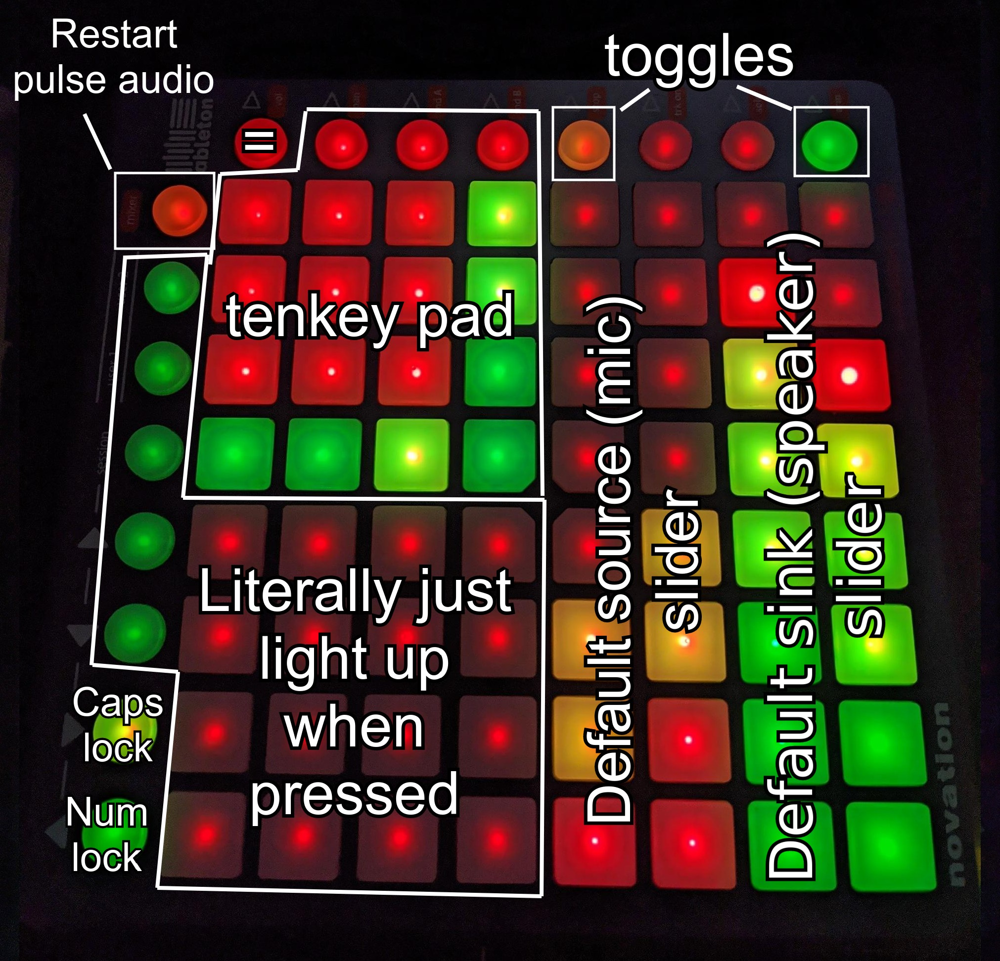

*Gizmo disclaimer: All gizmos are on a they-work-on-my-machine basis. These are hacks I've thrown together to make my life easier or to serve some small purpose where there exists no better tool. If this works for you, awesome! I hope you love it. If this doesn't work, hopefully it is useful as a reference or starting point :).*

# Launchpad System Controller
Communicates with the Launchpad-S for a fun, visual system controller.
Notice that I have rotated the device a quarter-turn counter clockwise.

### Current Functionality
- Talk to PulseAudio to update default sink and source volumes / toggles.
- Light up buttons which are not programmed
