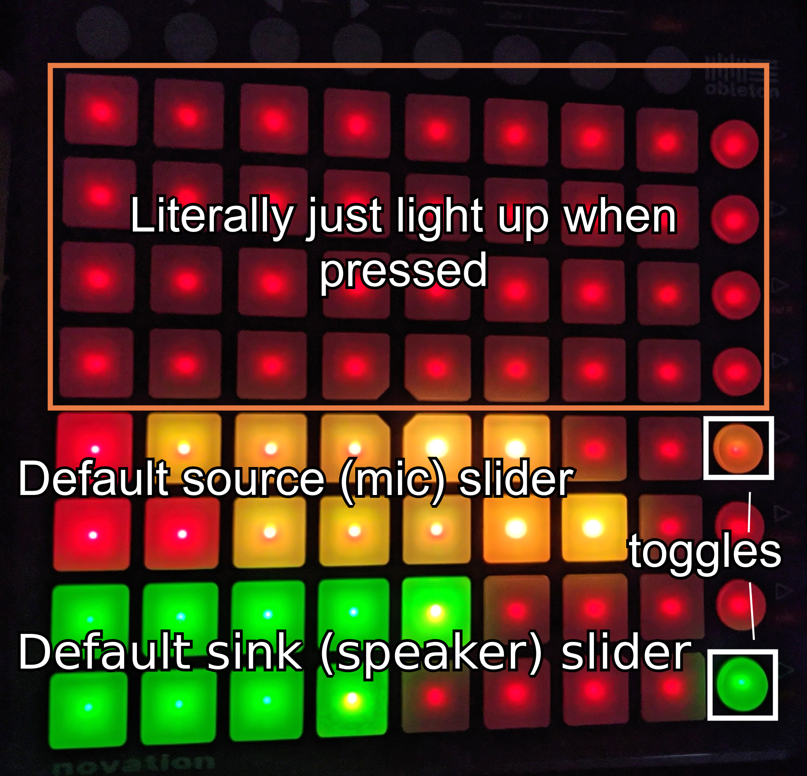

# Launchpad System Controller
Communicates with the Launchpad-S for a fun, visual system controller.

### Current Functionality
- Talk to PulseAudio to update default sink and source volumes / toggles.
- Light up buttons which are not programmed
